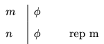
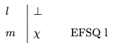

# Natural Deduction {#natdedprop}

We now develop a deductive system for propositional logic. The system will enable us to derive the conclusion of a valid argument from its premises in the language of propositional logic. These derivations will closely resemble chains of reasoning we may use to convince ourselves that a proposition follows from others in natural language. One difference, however, is that our derivations will display a very rigid structure where each step we take will be codified by a formal rule of inference. These rules of inference will in turn be closely tied to the semantic behavior of the connectives they formalize.

It will turn out that an argument formulated in the language of propositional logic is valid if, and only if, there is a derivation of the conclusion from its premises. That means that the deductive system will provide yet another approach to the study of validity in propositional logic.

There is a variety of different proof systems for propositional logic designed for different purposes. Some of them are specifically designed to facilitate the design of proofs in accordance with rules that are not dissimilar from steps we take in more familiar contexts, whereas others minimize the rules of inference available for a derivation in order to focus on the study of the metatheory of propositional logic. Here we will focus on a system of the first type otherwise known as a *natural deduction* system.

One way to approach an argument is to break it down into a series of elementary inferences that take us from the premises of the argument to its conclusion. These intermediate steps are licensed by rules of inference designed to either exploit or introduce complex formulas of a certain form. Such a chain of elementary inferences will be a *derivation*.


Derivation

:   A *derivation* is a finite sequence of formulas, some of which may be marked as *premises* and *assumptions*. Other formulas in the sequence will be licensed by the application of a rule of inference to one or more prior formulas in the series. The last formula in the sequence will be its *conclusion*.

This preliminary characterization of a derivation will remain incomplete until we specify the rules of inference for the system, which we will do next. Once the rules of inference are in place, we will be able to check a purported derivation to make sure that each step accords with one of the rules and that the chain of inferences qualifies as a derivation.

Derivations will take the form of a numbered series of formulas that begin with the assumptions of the argument. We do this in order to be able to refer back to prior formulas in the proof, and we will draw a horizontal line after the premises. While formulas above the line are *assumptions*, the formulas that follow will be explicitly licensed by the rules of inference of the system or will on occasion be another assumption, which will be labelled as such.


Derivability

:   A formula $\varphi$ is *derivable from* a set of sentences $\Gamma$ if, and only if, there is a *derivation* of $\varphi$ whose non-discharged assumptions, if any, are all in $\Gamma$.

We will write $\Gamma \vdash \varphi$ to abbreviate the phrase '$\varphi$ is derivable from $\Gamma$.' If $\Gamma$ is empty, we will just write $\vdash \varphi$. If $\Gamma$ contains a finite number of sentences $\psi_1, \dots, \psi_n$, we will write $\psi_1, \dots, \psi_n \vdash \varphi$.


## Natural Deduction Rules {-}

Most natural deduction rules constrain either the introduction or the elimination of a connective in some complex formula of propositional logic. Each connective is governed by an introduction rule, which specifies the conditions under which a complex formula with that connective may be introduced into the derivation, and an elimination rule, which explains how to exploit a complex formula with that connective.

There is one important exception. We have a single structural rule, which enables us to repeat a formula from an earlier available line.

```{marginfigure, echo=TRUE}
\
  Repetition
```

Repetition

:   You may repeat a formula $\varphi$ on a line if it is available on a prior line of the derivation.


The annotation indicates that we are allowed to repeat the formula on line $n$ at a later line $m$.

This is perhaps the simplest derivation you will ever encounter.

:::{.example}
$p \vdash p$

`r pc_iframe_card(proofs[["rep-worked"]], card = "verify", solution = TRUE)` 
:::


## Conjunction and Conditional {-}

We will now specify introduction and elimination rules for conjunction and the conditional, and we will postpone the discussion of similar rules for disjunction and negation until later.

```{marginfigure, echo=TRUE}
\
  Conjunction Introduction
```

Conjunction Introduction

:   You may write a conjunction $\varphi \wedge \psi$ on a line if $\varphi$ and $\psi$ are available at prior lines in the derivation.


To illustrate the rule, notice how conjunction introduction suffices for a derivation of $p \wedge (r \wedge q)$ from the premises $p$, $q$, and $r$:

:::{.example}
$p, q, r \vdash p \wedge (r \wedge q)$

`r pc_iframe_card(proofs[["andI-worked"]], card = "verify", solution = TRUE)` 
:::

```{marginfigure, echo=TRUE}
\
  Conjunction Elimination
```

Conjunction Elimination

:  You may write a conjunct $\varphi$ on a line if a conjunction $\varphi \wedge \psi$ is available at a prior line.

:  You may write a conjunct $\psi$ on a line if a conjunction $\varphi \wedge \psi$ is available at a prior line.


By way of illustration, note how conjunction elimination suffices for a derivation of $r$ from the premise $p \wedge (r \wedge q)$:

::: {.example}
$p \wedge (r \wedge q) \vdash r$

`r pc_iframe_card(proofs[["andE-worked"]], card = "verify", solution = TRUE)` 

:::

```{marginfigure, echo=TRUE}
\
  Conditional Elimination
```

Conditional Elimination

:   You may write $\psi$ if the conditional $\varphi \to \psi$ and $\varphi$ are available at prior lines.


We may now produce derivations for more sophisticated arguments.

::: {.example}
$p, \ p \to (q \wedge r), \ q \to (s \wedge t) \vdash r \wedge t$

`r pc_iframe_card(proofs[["mp-worked"]], card = "verify", solution = TRUE)` 

:::


```{marginfigure, echo=TRUE}
\
  Conditional Introduction
```

Conditional Introduction

:   You may write $\varphi \to \psi$ if you are able to derive $\psi$ from the assumption that $\varphi$. Once you do, you should bracket the lines employed in your auxiliary derivation of $\psi$ from the assumption that $\varphi$ and never appeal to them again.

The thought behind the rule is simple. We are entitled to write the conditional $\varphi \to \psi$ by itself on a line if we convince ourselves that we may eventually reach $\psi$ on the assumption that $\varphi$.

Let us look at two applications of this rule:

::: {.example}
$p \to (q \wedge r) \vdash p \to (r \wedge q)$

`r pc_iframe_card(proofs[["condI-worked-1"]], card = "verify", solution = TRUE)` 

:::

::: {.practice}
$p \wedge q \vdash p \to q$

`r pc_embed_toggle_cards(proofs[["condI-practice-2"]], proofs[["condI-worked-2"]])`
:::


## Disjunction and Negation {-}

The introduction and elimination rules for disjunction and negation require more care. We start with the rules for disjunction and postpone the discussion of negation until the end.

```{marginfigure, echo=TRUE}
\
  Disjunction Introduction
```

Disjunction Introduction

:   You may write a disjunction $\varphi \vee \psi$ if a disjunct becomes available at a prior line.


```{marginfigure, echo=TRUE}
\
  Disjunction Elimination
```

The thought is that a disjunction must be the case if one of its disjuncts is the case. If Pluto is a planet, then Pluto is a planet or the Sun is a planet. For remember that all it takes for a disjunction to be the case is that one of its disjuncts is the case.


Disjunction Elimination

:   You may write $\chi$ if the disjunction $\varphi \vee \psi$ and the conditionals $\varphi \to \chi$ and $\psi \to \chi$ are available at prior lines.


By way of motivation, notice that if $\varphi \vee \psi$ is the case, then there are two horns to consider. If $\varphi \to \chi$, then one horn leads to $\chi$, and if $\psi \to \chi$, then the other horn leads to $\chi$. But now, if both horns lead to $\chi$, then we should be able to conclude $\chi$ on the basis of the disjunction $\varphi \vee \psi$ and the two conditionals above.


Here is an example of the elimination rule in action.

::: {.example}
$(p \wedge q) \vee (q \wedge p) \vdash p$

`r pc_iframe_card(proofs[["disjE-worked"]], card = "verify", solution = TRUE)`
:::

We finally introduce natural deduction rules for negation, which is the last connective left to consider. To reason with negation, it will be convenient to introduce a *new* symbol into the deductive system: $\bot$. This symbol, which is sometimes called *falsum* or *bottom* or *bot*, is designed to record the fact that we have arrived at a contradiction, and though it is not an official symbol of the language of propositional logic, it will play an auxiliary role in the formulation of the introduction and elimination rules for negation.

```{marginfigure, echo=TRUE}
\
  Negation Elimination
```

Negation Elimination

:   You may write $\bot$ once a formula and its negation have become available at prior lines.

One way to understand the rule is as a permission to write the symbol for absurdity in the presence of a formula and its negation.


```{marginfigure, echo=TRUE}
\
  Negation Introduction
```

Negation Introduction

:   You may write a negation $\neg \varphi$ if you are able to derive $\bot$ from the assumption that $\varphi$. Once you do, you should bracket the lines employed in your auxiliary derivation of $\bot$ from the assumption that $\varphi$ and never appeal to them again.


::: {.example}
$p \vdash \neg \neg p$

`r pc_iframe_card(proofs[["negI-worked-1"]], card = "verify", solution = TRUE)`

:::

This rule requires some explanation. What motivates it is the thought that we should conclude a negation of the form $\neg \varphi$ if we find that we are able to reach an absurdity on the assumption that $\varphi$ is the case. How do we know that the square root of $2$ is *not* rational? Because we are able to reach an absurdity from the assumption that $\sqrt{2}$ is a ratio of two integers $\frac{p}{q}$ without a common factor.^[If $\sqrt{2} = \frac{p}{q}$, then $2 = \frac{p^2}{q^2}$ and $p^2 = 2q^2$. That means that $p^2$ is even, which requires $p$ to be even. It follows that $p^2$ is divisible by $4$, making $q^2$ and $q$ even. So $p$ and $q$ are both even, which means that they share a common factor. That is absurd, since we began with the assumption that they have no factors in common.]


::: {.practice}
$p \to q, \neg q \vdash \neg p$


`r pc_embed_toggle_cards(proofs[["negI-practice-2"]], proofs[["negI-worked-2"]])`
:::

```{marginfigure, echo=TRUE}
\
  Ex Falso Sequitur Quodlibet
```

Ex Falso Sequitur Quodlibet

:   You may write any formula once $\bot$ becomes available at a prior line.

The Latin phrase *Ex Falso Sequitur Quodlibet* means that anything at all follows from a contradiction, and we will use the abbreviation EFSQ for the rule that enables us to write an arbitrary formula after a contradiction.


:::{.example}
$p \vee q, \neg p \vdash q$

`r pc_iframe_card(proofs[["efsq-worked-1"]], card = "verify", solution = TRUE)`

:::


:::{.practice}
$\neg p \vdash p \to q$

`r pc_embed_toggle_cards(proofs[["efsq-practice-2"]], proofs[["efsq-worked-2"]])`
:::

We require one more rule in order to be able to cancel a double negation. That is, we want a rule designed to help us move from $\neg \neg \varphi$ to $\varphi$.

```{marginfigure, echo=TRUE}
\
  Double Negation
```


Double Negation

:   You may write a formula $\varphi$ if a double negation $\neg \neg \varphi$ is available at a prior line.


:::{.example}
$\vdash p \vee \neg p$

`r pc_iframe_card(proofs[["dn-worked"]], card = "verify", solution = TRUE)`

:::

That completes the list of natural deduction rules for propositional logic. They suffice for the purpose of deriving a conclusion from the premises of any valid argument of propositional logic.


## How to Construct Proofs {-}

There is no algorithm we can use in order to find a proof of a conclusion from a set of given premises, but sustained practice will help you develop a sense of how to proceed in each case. There are, however, some strategies to keep in mind when you first encounter a problem.

Your plan for a proof will require you to work backwards from what you want.

- If the conclusion of the argument is a conjunction $\varphi \wedge \psi$, then you should plan to use the rule of conjunction introduction. In order to do that, you will aim to produce an auxiliary derivation of $\varphi$ and an auxiliary derivation of $\psi$. Once they are in place, you will be able to write the conjunction by itself on a line citing conjunction introduction.

- If the conclusion of the argument is a conditional $\varphi \to \psi$, then you should generally plan to use the rule of conditional introduction. That is, you should plan to construct an auxiliary derivation of the consequent from the assumption of the antecedent. The derivation in question will therefore begin with $\varphi$ as an assumption and end with $\psi$ as a conclusion. Given such a derivation, conditional introduction will license us to write the conditional on a line.

- If the conclusion is a negation of the form $\neg \varphi$, then you will plan to use the rule of negation introduction. In order to be able to apply it, you will start an auxiliary derivation of $\bot$ from $\varphi$ as an assumption. Once the derivation is complete, you will be able to write the negation by itself on the basis of negation introduction.

Once you have devised a plan for a proof, you will work forward from your premises and/or assumptions in order to fill the gaps in the argument. The elimination rules for each connective allow you to exploit them in order to complete some of the intermediate steps from the premises and assumptions to the desired conclusions.

- Given a conjunction $\varphi \wedge \psi$, you may use conjunction elimination in order to write each conjunct by itself on a line, which may in turn be one of the intermediate steps required for the argument.

- Given a disjunction $\varphi \vee \psi$, you may use disjunction elimination, which is designed to capture a familiar type of reasoning: if we are able to prove a sentence $\chi$ from each disjunct, then we are entitled to write $\chi$ by itself on the basis of the disjunction.

- To exploit a conditional $\varphi \to \psi$, we aim to find $\varphi$ by itself on a line, because we know that conditional elimination will then enable us to write $\psi$ by itself on a line.

- The case of negation $\neg \varphi$ is more delicate. We know that we are able to introduce $\bot$ by itself on a line if we are able to find an auxiliary derivation of $\varphi$, which then becomes the new subgoal in order to exploit the original negation.


## Exercises {-}


1. Provide a natural deduction proof to justify each of the claims below. Try each in the proof checker, then use the link to check your work.

    a. $p, \neg q \vdash p \to (\neg q \vee r)$
    
          `r pc_embed_toggle_cards(proofs[["ex5-a-worked"]], worked_height = 380L)`
    
    #. $p \to (q \vee r), \neg q, \neg r \vdash \neg p$
    
          `r pc_embed_toggle_cards(proofs[["ex5-b-worked"]], worked_height = 380L)`
    
    #. $p \to \neg(q \wedge r), q, \neg r \to \neg q \vdash \neg p$
    
        `r pc_embed_toggle_cards(proofs[["ex5-c-worked"]], worked_height = 380L)`
    
    #. $p \to q, q \vee r, r \to (p \vee q) \vdash q$
    
        `r pc_embed_toggle_cards(proofs[["ex5-d-worked"]], worked_height = 420L)`
    
    #. $(p \wedge q) \to (q \vee r), \neg r \to (\neg p \to q) \vdash p$
    
        `r pc_embed_toggle_cards(proofs[["ex5-e-worked"]], worked_height = 500L)`
