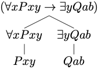
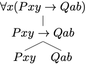

# (PART) Quantificational Logic {-}


# Formal Language

The language of quantificational logic will afford the means to capture the validity of a variety of arguments for which propositional logic appears to be inadequate. We specify:

- a *syntax* for the language, which will include a vocabulary and a set of grammatical rules designed to specify which expressions are formulas of the language, and

- a *semantics* for the language, which will explain how to interpret the expressions and formulas of the language and define what is for a formula to be true under a given interpretation.


## Syntax {-}

We begin with the vocabulary of quantificational logic.

```{marginfigure, echo=TRUE}
Vocabulary
```

The vocabulary of quantificational logic contains six types of symbol:

Constants

:   These are the lowercase letters $a$, $b$, $c$, $d$, and $e$ with or without numerical subscripts:

  $$
   a, b, c, d, e
  $$

Predicates

:   These are uppercase letters $P$, $Q$, $R$, $S$, and $T$ with or without numerical subscripts. Each predicate comes with a fixed number of argument places. 

$$
  P, Q, R, S, T
   \dots
   $$

Variables

:   These are lowercase letters $x$, $y$, and $z$ with or without numerical subscripts:

$$
x, y, z \dots
$$

Connectives

:   These are the symbols:
$$
\neg, \vee, \wedge, \to
$$

Quantifiers

:   There are two quantifier expressions:
$$
\forall, \exists
$$

Parentheses

:   There are two parentheses:
$$
), (
$$

:   Nothing else is a symbol of the language.


```{marginfigure, echo=TRUE}
Grammar
```

The grammar of quantificational logic explains how to combine these symbols into formulas of the language. We proceed in two stages.

Atomic Formula

:   If $P$ is a predicate with $n$ argument places, and each of $\tau_1, \dots, \tau_n$ is a constant or a variable, then
$$
P\tau_1 \dots \tau_n
$$
is an *atomic formula*.

Atomic formulas are the formal counterparts of simple predications such as 'Los Angeles is a city' or 'Los Angeles is between San Diego and San Francisco'. 


::: {.example}
Each of the expressions below is an atomic formula of quantificational logic:
$$
\begin{array}{c}
Pxy\\ 
Qabx\\ 
Rxaby_3\\ 
\dots
\end{array}
$$
:::

Atomic formulas provide simple constituents for more complex formulas.

Formula

:   We now define what is for an expression to be a formula of quantificational logic.

:::{.info}
1. All atomic formulas are *formulas*.\
2. If $\varphi$ and $\psi$ are *formulas*, then each of
$$
\neg  \varphi, (\varphi \wedge \psi), (\varphi \vee \psi), (\varphi \to \psi)
$$
is a *formula*.\
3. If $\varphi$ is a formula and $x$ is a variable, then each of $\forall x \varphi$ and $\exists x \varphi$ is a formula.\
4. Nothing else is a *formula*.
:::


We proceed to illustrate the characterization of formula through concrete examples. 

```{marginfigure, echo=TRUE}

  
The construction tree depicts the construction of the formula from simpler constituents.
```

::: {.example}
The expression below is a formula of quantificational logic:
$$
(\forall x Pxy \to \exists y \ Qab)
$$

:::{.argument} 
By rule 2, $(\forall x Pxy \to \exists y \ Qab)$ is a formula if $\forall x \ Pxy$ and $\exists y \ Qab$ are each a formula.\
By rule 3, $\forall x \ Pxy$ is a formula if $Pxy$ is a formula.\
By rule 3, $\exists y \ Qab$ is a formula if $Qab$ is a formula.\
By rule 1, each  $Pxy$ and $Qab$ are formulas, since they are each atomic formulas.\
:::
Therefore, we conclude that $(\forall x Pxy \to \exists y \ Qab)$ is a formula of quantificational logic.
:::

```{marginfigure, echo=TRUE}

  
The construction tree depicts the construction of the formula from simpler constituents.
```

::: {.example}
The expression below is a formula of quantificational logic:
$$
\forall x (Pxy \to Qab)
$$

:::{.argument}
By rule 3, $\forall x (Pxy \to Qab)$ is a formula if $(Pxy \to Qab)$ is a formula.\
By rule 2, $(Pxy \to Qab)$ is a formula if each $Pxy$ and $Qab$ are formulas.\
By rule 1, each  $Pxy$ and $Qab$ are formulas, since they are each atomic formulas.\
:::

Therefore, we conclude that $\forall x (Pxy \to Qab)$ is a formula of quantificational logic.
:::

We now make a distinction between two types of occurrences of a variable in a formula. In the formula $\forall x (Qxy \to Ryx)$ the last two occurrences of the variable $x$ match the variable accompanying the quantifier expression, whereas the occurrences of the variable $y$ do not. The occurrences of the variable $x$ have been captured by the initial quantifier, but the occurrences of the variable $y$ remain free. 

```{marginfigure, echo=TRUE}
Free Occurrences
```

Free Occurrence of a Variable

:   We define what is for an occurrence of a variable to be *free* in a formula:

:::{.info}
1. All occurrences of a variable in an atomic formula are free.
2. The free occurrences of a variable in formulas of the form $\varphi$ and $\psi$ remain free when they occur in
$$
\neg  \varphi, (\varphi \wedge \psi), (\varphi \vee \psi), (\varphi \to \psi)
$$
3. No occurrence of the variable $v$ is free in a formula of the form 
$$
\forall v \varphi, \exists v  \varphi
$$
All occurrences of variables other than $v$ that are free in $\varphi$ remain free in those  formulas.
:::

::: {.example}
The first two occurrences of the variable $x$ occur free in the formula:
$$
Px \to (Qxy \to \forall x Rxx)
$$

:::{.argument}
By rule 1, $x$ occurs free in $Px$, which is an atomic formula, and, by rule 3, the occurrence remains free when it occurs in a conditional of the form $Px \to \psi$.\

By rule 1, $x$ occurs free in $Qxy$, which is an atomic formula, and, by rule 2, the occurrence remains free when it occurs in a formula of the form $(Qxy \to \psi)$.\

By rule 2, the last two occurrences of $x$ in $\forall x Rxx$ are not free.\
:::
:::

An occurrence of a variable is free when it has not been captured by a quantifier. In the last example, the last two occurrences of the variable $x$ are under the scope of the universal quantifier $\forall x$, whereas the first two occurrences of the variable are not under the scope of a quantifier.

```{marginfigure, echo=TRUE}
Bound Occurrences
```

Bound Occurrence of a Variable:

:   An occurrence of a variable in a formula is *bound* if, and only if, it is not free in that formula.


A variable occurs *freely* in a formula if, and only if, some of its occurrences in the formula are *free*.

```{marginfigure, echo=TRUE}
Open and Closed Formulas
```

Open and Closed Formulas

:   A formula is *open* if, and only if, some variables occur freely in the formula. Otherwise, the formula is *closed*.


::: {.example}
The formula below is open:
$$
(\forall x \exists y Rxy \vee Qyx)
$$
This is because the  last occurrences of the variables $y$ and $x$ are free in the formula.
:::


:::{.example}
The formula below is closed:
$$
\forall x \exists y (Rxy \vee Qyx)
$$
The difference with respect to the last formula is that all occurrences of the variables $y$ and $x$ are now captured by the quantifiers $\exists y$ and $\forall x$, respectively.
:::


Notational Convention	

:   We may remove the outer parentheses from a formula that is not part of another formula.


Notice that this convention will *not* allow us to omit the parentheses in a formula such as:
$$
\forall x (Rxa  \to Rax).
$$
For $(Rxa  \to Rax)$ is here part of the formula $\forall x (Rxa  \to Rax)$. Such a formula is  importantly different from:
$$
(\forall x Rxa \to Rax).
$$
The former formula is a *closed formula* whereas the latter is an *open formula*, since the last occurrence of the variable $x$ is free in $(\forall x Rxa \to Rax)$ as it is not in the scope of the universal quantifier  $\forall x$. 

::: {.example}
We are able to use the expression
$$
\forall x Rxa \to Rax
$$
as an abbreviation for the formula
$$
(\forall x Rxa \to Rax)
$$
:::


## Exercises {-}

1. Determine whether each of the following expressions is an atomic formula of quantificational logic.

     a. $\neg Rxy$

     #. $Rxy$
     
     #. $Aabx$
     
     #. $Qe$
     
     #. $Pxyza$
     
     #. $RPa$


#. Determine whether each of the following expressions is a formula of quantificational logic.

     a. $\neg \neg Rxy$
     
     #. $(Pa \to (Axy \wedge \exists x Qx))$
     
     #. $\forall x Ryy$
     
     #. $\exists x y (P \wedge P(y))$
     
     #. $\forall \forall x Ryx$
     
     #. $\exists x \exists y Rxy$
     
     
#.  Determine whether each of the following expressions is an *abbreviation* for a formula of quantificational logic.    

    a. $\exists x \exists y Rxy \to Px$
    
    #. $\forall x Rx \vee \exists y Qyy$
    
    #. $Px \wedge Qx \vee Rxy$
    
    #. $Px \wedge Qx \to Rxy$
    
    #. $\exists x Px \wedge \exists y Qy \wedge \exists z Rz$
    
    #. $\exists x \forall y \exists z (Px \wedge Qy \wedge Rxyz)$
         
  
#.  Determine whether the following  formulas contain a free occurrence of the variable $x$.

    a. $\forall x (Rxy  \wedge Ryx)$
    
    #. $\forall x Rxy \wedge Ryx$
    
    #. $\exists x (Px \wedge Qx) \to \forall y Rxy$
    
    #. $\forall x \exists y  Rxy \to \exists x \forall y  Ryx$
    
    #. $\forall x \exists y Rxy \to \forall y  Ryx$
    
    #. $\forall x (\exists y Rxy \to \forall y  Ryx)$

#. Determine whether the following formulas are *open* or *closed*. Justify your answers.

    a. $\forall x Rxy  \wedge Ryx$
    
    #. $Rab$
    
    #. $\exists x (Pax \wedge Qxa) \to \forall y Rxy$
    
    #. $\forall x Ryy$
    
    #. $\forall x \exists y \forall z Rxyx$
    
    #. $Rax \to \forall x Rxx$
    
