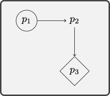
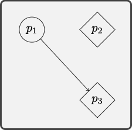

# Translation

We want to use the language of quantificational logic for the evaluation of natural language arguments. That will require us to be able to translate from natural language  into the formal language of quantificational logic. We proceed in stages. We will briefly consider the case of predications, which are some of the simplest natural language sentences, and we will pay special attention to the translation of quantifier phrases. 

## A Translation Method {-}

We build on the translation method we used for propositional logic. That is, we will first indicate how natural language sentences are constructed from simpler sentences by means of the usual propositional connectives. The difference is that we will now look for further structure into the sentences we would have formalized with the help of a propositional variable in propositional logic.

**Predication**

We use predications to translate the most basic parts of the target sentence.

Consider the sentence:

:::{.argument}
Alice talked to the King, and the King talked to the Queen.
:::

The translation method for propositional logic generates:

:::{.argument}
(Alice talked to the King $\wedge$ the King talked to the Queen.)
:::
In a further step, we now make use of predicates and constants to translate the simplest sentences:

```{marginfigure, echo=TRUE}
*Translation key*\
$a$: Alice\
$b$: The King\
$c$: The Queen\
$R$ \_  \_ : \_  talked to \_
```

:::{.argument}
$Rab \wedge Rbc$
:::


Quantifier phrases require more discussion. We will look at the case of simple quantifier expressions such as 'something' and 'everything' and we will then move to more complex quantifier phrases such as 'some apple' and 'every computer', which require separate discussion.


**Quantifiers**

We paraphrase the relevant sentences to make clear how they may be built from simpler constituents with the help of quantifiers such as 'something' and 'everything'.

One may rephrase 'Something is heavy' as 'Some *thing* is such that *it* is heavy'. The pronoun 'it' will rendered as a variable, which will be bound by the existential quantifier that corresponds to 'something'. Consider the sentence:

:::{.argument}
Something is heavy.
:::

We rephrase it with the help of a pronoun, which will eventually be replaced with a variable:

```{marginfigure, echo=TRUE}
*Translation key*\
$P$ \_ : \_ is heavy.
```

:::{.argument}
Some *thing* is such that *it* is heavy.\
$\exists x Px$
:::


Similarly for the sentence:

:::{.argument}
Everything is a material object.
:::

We now rephrase it with the help of a pronoun, which will eventually be replaced with a variable:

```{marginfigure, echo=TRUE}
*Translation key*\
$Q$ \_ : \_ is a material object.
```

:::{.argument}
Every *thing* is such that *it* is a material object.\
$\forall x Qx$
:::


Similarly for predicates with more than one argument place:

```{marginfigure, echo=TRUE}
*Translation key*\
$a$: San Francisco\
$R$ \_  \_ : \_ is south of \_
```

:::{.argument}
Something is south of San Francisco \
Some *thing* is such that *it* is south of San Francisco.\
$\exists x Rxa$
:::


**Common quantifier phrases**

Common quantifier phrases combine a quantifier such as 'some' or 'a' and 'all' or 'every' with a monadic predicate such as 'apple' or 'student' as in 'some apples' or 'every city'. 


There are two main types of natural language sentence to consider:

:::{.argument}
Some apples are delicious.\
All computers are expensive.
:::

When the quantifier phrase combines 'some' with a monadic predicate, then we proceed as follows:

```{marginfigure, echo=TRUE}
*Translation key*\
$P$ \_ :  \_  is an apple
```

:::{.argument}
'Some apples  $\dots$'\
'Some *thing* is such that *it* is an apple *and* $\dots$ *it* $\dots$'\
$\exists x (Px \wedge \dots x \dots)$
:::


Consider the sentence:

:::{.argument}
Some apples are delicious.
:::
We now rephrase it with the help of a pronoun, which will eventually be replaced with a variable:

```{marginfigure, echo=TRUE}
*Translation key*\
$P$ \_ :  \_  is an apple\
$Q$ \_ : \_ is delicious
```

:::{.argument}
Some *thing* is such that *it* is an apple and *it* is delicious.\
$\exists x (Px \wedge Qx)$
:::


Similarly for the sentence:

```{marginfigure, echo=TRUE}
*Translation key*\
$a$:  San Francisco\
$P$ \_ :  \_ is a city\
$R$ \_ \_ : \_ is south of \_
```

:::{.argument}
Some city is south of San Francisco\
Some *thing* is such that *it* is a city and *it* is south of San Francisco.\
$\exists x (Px \wedge Rxa)$
:::


When the quantifier phrase combines 'every' or 'all' with a monadic predicate, then we proceed as follows:

```{marginfigure, echo=TRUE}
*Translation key*\
$P$ \_ : \_ is a computer\
```

:::{.argument}
Every computer $\dots$\
Every *thing* is such that *if* *it* is a computer, *then* $\dots$ *it* $\dots$\
$\forall x (Px \to \dots x \dots)$
:::


Consider the sentence:

:::{.argument}
Every computer is expensive
:::

We now rephrase it with the help of a pronoun, which will eventually be replaced with a variable:

```{marginfigure, echo=TRUE}
*Translation key*\
$P$ \_ :  \_ is a computer\
$Q$ \_ : \_ is expensive
```

:::{.argument}
Every *thing* is such that if *it* is a computer, then *it* is expensive.\
$\forall x (Px \to Qx)$
:::


Similarly for the sentence:

```{marginfigure, echo=TRUE}
*Translation key*\
$P$ \_ : \_  is a computer\
$R$ \_ \_ : \_ is connected to \_ \
$a$: The network
```

:::{.argument}
Every computer is connected to the network.\
Every *thing* is such that if *it* is a computer, then *it* is connected to the network.\
$\forall x (Px \to Rxa)$
:::


**Multiple Generality**

Some predicates with multiple argument places may combine with more than one quantifier phrase:

:::{.argument}
Something is is south of San Francisco\
Something is south of something\
Some city is south of something\
Some city is south of some city
:::


Consider the sentence:

:::{.argument}
Something is south of something
:::

We now paraphrase the sentence:

```{marginfigure, echo=TRUE}
*Translation key*\
$R$ \_ \_ : \_ is south of \_
```

:::{.argument}
Some *thing$_x$* is such that some *thing$_y$* is such that *it$_x$* is south of *it$_y$*.\
$\exists x \exists  y  Rxy$
:::

Consider now the sentence:

:::{.argument}
Some city is south of something.
:::

We now paraphrase the sentence:


```{marginfigure, echo=TRUE}
*Translation key*\
$P$ \_ : \_ is a city\
$R$ \_ \_ : \_ is south of \_
```

:::{.argument}
Some *thing$_x$* is such that *it$_x$* is a city and some *thing$_y$* is such that *it$_x$* is south of *it$_y$*.\
$\exists x (Px \wedge  \exists  y  Rxy)$
:::


For yet another example, consider the sentence:

:::{.argument}
Some city is south of some city.
:::

We now paraphrase the sentence:

```{marginfigure, echo=TRUE}
*Translation key*\
$P$ \_ :  \_ is a city\
$R$ \_ \_ : \_ is south of \_
```

:::{.argument}
Some *thing$_x$* is such that *it$_x$* is a city and some *thing$_y$* is such that *it$_x$* is a city and *it$_x$* is south of *it$_y$*.\
$\exists x (Px \wedge  \exists  y  (Py \wedge Rxy))$
:::


Some sentences combine a universal and existential quantifier phrases.

:::{.argument}
Every student takes some course\
Some student takes every course\
Some course is taken by every student
:::


Consider the sentence:

:::{.argument}
Every student takes some course
:::

We now paraphrase the sentence in stages:

```{marginfigure, echo=TRUE}
*Translation key*\
$P$ \_ : \_ is a student\
$Q$ \_ : \_ is a course\
$R$ \_ \_ : \_ takes \_
```


:::{.argument}
Every *thing$_x$* is such that if *it$_x$* is a student,  then *it$_x$* takes some course.\
Every *thing$_x$* is such that if *it$_x$* is a student, then some *thing$_y$* is such  that *it$_y$* is a course and *it$_x$* takes *it$_y$*\
$\forall x (Px \to \exists y (Qy \wedge Rxy))$
:::


Consider now the sentence:

:::{.argument}
Every student takes every course
:::

We now paraphrase the sentence in stages:

```{marginfigure, echo=TRUE}
*Translation key*\
$P$ \_ : \_ is a student\
$Q$ \_ : \_ is a course\
$R$ \_ \_ : \_ takes \_
```

:::{.argument}
Every *thing$_x$* is such that if *it$_x$* is a student,  then *it$_x$* takes every course.\
Every *thing$_x$* is such that if *it$_x$* is a student, then every *thing$_y$* is such that if *it$_y$* is a course, then *it$_x$* takes *it$_y$*.\
$\forall x (Px \to \forall y (Qy \to Rxy))$.
:::


For another example, consider the sentence:

:::{.argument}
Some course is taken by every student.
:::

We now paraphrase the sentence in stages:

```{marginfigure, echo=TRUE}
*Translation key*\
$P$ \_ : \_ is a student\
$Q$ \_ : \_ is a course\
$R$ \_ \_ : \_ takes \_
```

:::{.argument}
Some *thing$_x$* is such that *it$_x$* is a course and every student takes *it$_x$*.\
Some *thing$_x$* is such that *it$_x$* is a course and every *thing$_y$* is such that if *it$_y$* is a student, then *it$_y$* takes *it$_x$*\
$\exists x (Qx \wedge \forall y (Py \to Ryx))$
:::


## Issues with Translation {-}

Translation into quantificational logic is subject to its own special difficulties. We distinguish at least two families of problems.

**Special Quantifier Phrases**

Some quantificational structures pose special problems.


A

:   A whale lives underwater


Quantifier phrases of the form 'a $P$' may on occasion be translated with the help of a universal quantifier and they may on other occasions be translated with the help of an existential quantifier. Consider the contrast between typical utterances of the sentences below:

:::{.argument}
A whale lives underwater.\
A student aced the midterm.
:::


The first sentence is generally used to express a universal claim:

```{marginfigure, echo=TRUE}
*Translation key*\
$P$ \_ : \_ is a whale\
$Q$ \_ : \_ lives underwater
```

:::{.argument}
A whale lives underwater.\
Every *thing* is such that if *it* is a whale, then *it* lives underwater.\
$\forall x (Px \to Qx)$
:::


On the other hand, the second sentence is generally used to express an existential claim:

```{marginfigure, echo=TRUE}
*Translation key*\
$P$ \_ : \_ is a student\
$R$ \_ \_ : \_ aces \_ \
$a$: The Midterm
```

:::{.argument}
A student aced the midterm.\
Some *thing* is such that *it* is a student and *it* aced the midterm.\
$\exists x (Px \wedge Rxa)$.
:::


Any

:   Any philosopher thinks.

The quantifier phrase 'any' may be translated with the help of a universal or an existential quantifier in different cases.


Compare the sentences:

:::{.argument}
Any philosopher thinks. \
If any philosopher thinks, then Hegel does.
:::

The first sentence invites the use of a universal quantifier.

```{marginfigure, echo=TRUE}
*Translation key*\
$P$ \_ : \_ is a philosopher\
$Q$ \_ : \_ thinks
```


:::{.argument}
- Any philosopher thinks.
- Every *thing* is such that if *it* is a philosopher, then *it* thinks.
- $\forall x (Px \to Qx)$
:::


On the other hand, the second sentence suggests an existential quantifier:

```{marginfigure, echo=TRUE}
*Translation key*\
$P$ \_ : \_ is a philosophert\
$Q$ \_ : \_ thinks\
$a$: Hegel
```

:::{.argument}
If any philosopher thinks, then Hegel does.\
If some *thing* is such that *it* is a philosopher and *it* thinks, then Hegel thinks.\
$\exists x (Px \wedge Qx) \to Qa$
:::


Only 

:   Only seniors are eligible for the prize


How should we paraphrase this sentence? Here is a suggestion:

```{marginfigure, echo=TRUE}
*Translation key*\
$P$ \_ : \_ is a senior\
$Q$ \_ : \_ is eligible for the prize
```

:::{.argument}
All eligible for the prize are seniors \
Every *thing* is such that if *it* is eligible for the prize, then *it* is a senior  \
$\forall x (Qx \to Px)$
:::


The interaction between quantification and negation requires some care as well.

No

: No student is eligible for the prize.


There is a choice between two equivalent interpretations. Consider, first, the sentence:

```{marginfigure, echo=TRUE}
*Translation key*\
$P$ \_ : \_ is a student\
$Q$ \_ : \_ is eligible for the prize
```

:::{.argument}
Every student is not eligible for the prize.\
Every *thing* is such that if *it* is a student, then *it* is *not* eligible for the prize.\
$\forall x (Px \to \neg Qx)$
:::


For an alternative interpretation of the original sentence, consider:

:::{.argument}
It is not the case that some student is eligible for the prize.\
It is not the case that some *thing* is such that *it* is a student and *it* is eligible for the prize.\
$\neg \exists x (Px \wedge Qx)$
:::

Structural Ambiguity 

:   A sentence may be structurally ambiguous.


Consider the sentence:

:::{.argument}
Everything has a cause
:::

There is a choice between two non-equivalent interpretations:

```{marginfigure, echo=TRUE}
*Translation key*\
$R$ \_ : \_ is a cause of \_
```

:::{.argument}
Every *thing* is such that *it$_1$* has some cause.\
Every *thing$_x$ is such that some thing$_y$ is such that it$_y$ causes it$_x$.\
$\forall x \exists y Ryx$
:::


The alternative interpretation proceeds as follows:

```{marginfigure, echo=TRUE}
*Translation key*\
$R$ \_ : \_ is a cause of \_
```

:::{.argument}
Some thing$_x$ is such that it$_x$ causes everything.\
Some thing$_x$ is such that every thing$_y$ is such that it$_x$ causes it$_y$.\
$\exists x \forall y Rxy$
:::

The distinction is specially important when it comes to the evaluation of an argument such as the following:

1. Everything has a cause.
2. If everything has a cause, then God is the cause of everything.
3. God is the cause of everything.

The crucial observation is that premise two is plausible on one but not the other interpretation of the first premise.


Consider the sentence:

:::{.argument}
Every student registers for some course
:::

There is a choice between two *non-equivalent* interpretations:

```{marginfigure, echo=TRUE}
*Translation key*\
$P$ \_ : \_ is a student\
$Q$ \_ : \_ is a course\
$R$ \_  \_ : \_ registers for \_
```

:::{.argument}
Every *thing$_x$* is such that if *it$_x$* is a student, then *it$_x$* registers for some course.\
Every *thing$_x$* is such that if *it$_x$* is a student, then some thing$_y$ is such that *it$_y$* is a course and *it$_x$* registers for *it$_y$*.\
$\forall x (Px \to \exists y (Qy \wedge Rxy))$
:::


The alternative interpretation is this:

```{marginfigure, echo=TRUE}
*Translation key*\
$P$ \_ : \_ is a student\
$Q$ \_ : \_ is a course\
$R$ \_ \_ : \_  registers for \_
```

:::{.argument}
Some thing$_x$ is such that it$_x$ is a course and every student registers for *it$_x$*.\
Some thing$_x$ is such that it$_x$ is a course and every thing$_y$ is such that if *it$_y$* is a student, then *it$_y$* registers for *it$_x$*.\
$\exists x (Q(x) \wedge \forall y (Py \to  Ryx))$
:::


We are in a position to combine the skills we have gained in order to determine whether an argument formulated in English exemplifies a valid quantificational form.


::: {.example} 
Consider the argument:

1. All physicists admire Newton.
2. Newton admires some mathematicians.
3. So, some physicists admire some mathematicians.

We first translate the argument into the language of quantificational logic:

```{marginfigure, echo=TRUE}
*Translation key*\
$P$ \_ : \_ is a physicist\
$Q$ \_ : \_ is a mathematician\
$R$ \_ \_ : \_ admires \_ \
$a$ \_ : Newton
```

1. $\forall x (Px \to Rxa)$
2. $\exists x (Qx \wedge Rax)$
3. $\exists x (Px \wedge \exists y (Qy \wedge Rxy))$


The next step is to search for a model in which the premises are true and the conclusion false:

```{marginfigure, echo=TRUE}
$P$ \_ : \_  is enclosed by a circle \
$Q$ \_ : \_ is enclosed by a diamond \
$R$ \_ \_ : \_ points to \_\
$a : p_1$
```



:::


::: {.example} 
Consider the argument:

1. Some LA landmark is more beautiful than some NY landmark.
2. The Griffith Observatory is an LA landmark and Times Square is a NY landmark.
3. So, the Griffith Observatory is more beautiful than Times Square.

We first translate the argument into the language of quantificational logic:

```{marginfigure, echo=TRUE}
*Translation key*\
$P$ \_ : \_ is an LA landmark\
$Q$ \_ : \_ is a NY landmark\
$R$ \_ \_ : \_ is more beautiful than \_
```

1. $\exists x (Px \wedge \exists y (Qy \wedge Rxy))$
2. $Pa \wedge Qb$
3. $Rab$


The next step is to search for a model in which the premises are true and the conclusion false:

```{marginfigure, echo=TRUE}
$P$ \_ : \_ enclosed by a circle \
$Q$ \_ : \_ is enclosed by a diamond \
$R$ \_ \_ : \_ points to \_ \
$a : p_1$\
$b: p_2$
```


:::


## Exercises {-}

1. Translate the following sentences into the language of quantificational logic.

      a.  Some Trojans fear Achilles, but Achilles fears every Trojan.
      
      #.  All Trojans are courageous.
      
      #. Only Trojans come from Troy.
      
      #. No Greek comes from Troy.
      
      #. Achilles fears Paris, but Paris fears no one.
      
      #. Some Greeks fears some Trojans, and some Trojans fear some Greeks.
      
      
#.  Assess the following arguments for quantificational validity.

      a. All poisonous frogs are amphibians. Kermit is a poisonous amphibian. Therefore, Kermit is a frog.
      
      #.  Aristotle admired anyone who taught for free. Socrates taught for free, but no sophist did ever teach for free. So, Aristotle did not admire a sophist.
      
      #. No weekday comes after Saturday. Monday is a weekday, but Sunday is not. Therefore, Monday does not come after Sunday.
      
      #. Some cube is green all over and some cube is red all over. No cube is both green all over and red all over. Some sphere is green all over. So, some sphere is not red all over.
      
      #. No Trojan fears Achilles, but Achilles fears some Trojans. Paris is a Trojan. So, Achilles fears Paris but Paris does not fear Achilles.
      
      #. Some stadium is close to University Park. The Coliseum is a stadium. Therefore, the  Coliseum is close to University Park.
      
      #. Los Angeles is connected by direct flight to London. London is connected by direct flight to every major European city. Barcelona is a major European city. Therefore, Los Angeles is connected by direct flight to Barcelona.
      
      #. All Greeks feared Hector or Paris. Paris feared no Greek who feared Hector. Therefore, some Greeks feared Paris.
      