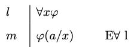
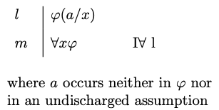
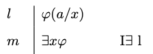
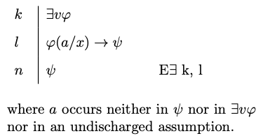

# Natural Deduction

We have effective means to determine, in a finite number of steps, whether an argument formulated in propositional logic is valid. We may, for example, devise a complete truth table for the argument and look for an assignment corresponding to one of the rows of the truth table on which the premises are true and the conclusion is false. If no such assignment is found, then the argument is valid; otherwise, the argument is invalid. The procedure may be overly complex in certain cases, especially when the argument in question happens to involve a high number of propositional variables, but it will nevertheless produce a verdict in a *finite* number of steps.

Matters are more complicated for quantificational logic. For we are not of course in a position to survey *every* model for the relevant fragment of the language in order to determine whether there is one on which the premises are true and the conclusion is false. There is an infinite number of them, and there is no effective procedure we can use to survey them all in a finite number of steps. To be sure, if the argument is invalid, we should be able to find a model in which the premises are true and the conclusion is false, but we may not be sure at times whether a temporary failure to find such a model may be due to a lack of imagination rather than to the invalidity of the argument.

Instead, we will develop a natural deduction system for quantificational logic, one which adapts and extends the framework we developed for propositional logic. Once the natural deduction system is in place, we will establish the validity of an argument in the language of quantificational logic by means of a proof of the conclusion from the premises of the argument.

Since quantificational logic includes the usual propositional connectives, we will just import and adapt the introduction and elimination rules we devised for them to the new framework. That is enough to enable us to establish the validity of *some* arguments in the language of quantificational logic.


:::{.example}
$\forall x Px \to \exists x Px, \neg \exists x Px \vdash \neg \forall x Px$

`r pc_iframe_card(proofs[["ch10-eg1"]], card = "verify", solution = TRUE)` 
:::


Notice that it suffices in this case to deploy natural deduction rules for negation and the conditional, which we adapt from the natural deduction system for propositional logic. 

On the other hand, we are not yet in a position to provide derivations that exploit the behavior of the quantifiers. We require additional natural deduction rules for that purpose.


## Universal Quantification {-}

We will introduce introduction and elimination rules for the universal and the existential quantifiers. But in order to even be able to state the rules, we must explain what we mean by an *instance* of a quantified formula of the form $\forall x \varphi$ or $\exists x \varphi$.

Instance

:  If $a$ is a constant, we let $\varphi(a/x)$ be the formula that results from $\varphi$ when we substitute $a$ for every *free* occurrence of the variable $x$ in $\varphi$. The formula $\varphi(a/x)$ is an *instance* of the quantified formulas $\forall x \varphi$ and $\exists x \varphi$, respectively.

:::{.example}
Some examples:

- $Pc$ is an instance of the universal quantification $\forall x Px$.
- $Ray$ is an instance of the universal quantification $\forall x Rxy$.
- $Rzbb$ is an instance of the universal quantification $\forall y Rzyy$.
- $Pb \to \exists x Qx$ is an instance of the existential quantification $\exists x (Px \to \exists x Qx)$.
:::


We start now with the elimination rule for the universal quantifier.

```{marginfigure, echo=TRUE}
\
  Universal Elimination
```


Universal Elimination

:   You may write an instance $\varphi(a/x)$ of a universally quantified formula $\forall x \varphi$ if the latter is available on a prior line of the derivation.


The rationale for universal elimination is that we are entitled to write that an individual $a$ satisfies a given condition if we are given that *all* individuals do.


Let us look at the universal elimination rule in action.


:::{.example}
$\forall x \forall y(Px \to Qy), Pa, \vdash Qb$.

`r pc_iframe_card(proofs[["ch10-eg3"]], card = "verify", solution = TRUE)` 
:::

:::{.example}
$\forall x \forall y Rxy \vdash Raa$.

`r pc_iframe_card(proofs[["ch10-eg4"]], card = "verify", solution = TRUE)` 
:::

The introduction rule for the universal quantifier requires more care. In order to be able to write $\forall x \varphi(x)$ by itself on a line, we should convince ourselves we have the means to establish some *arbitrary* instance $\varphi(a/x)$ where the constant $a$ does not occur in an undischarged assumption.


```{marginfigure, echo=TRUE}
\
  Universal Introduction
```


Universal Introduction

:   You may write a universally quantified formula $\forall x \varphi$ if some instance $\varphi(a/x)$ is available on a prior line and $a$ occurs neither in $\varphi$ nor in an undischarged assumption.


Let us look at some applications of the rule.

:::{.example}
$\forall x (Px \to Qx), \forall x (Qx \to Rx) \vdash \forall x (Px \to Rx)$.

`r pc_iframe_card(proofs[["ch10-eg5"]], card = "verify", solution = TRUE)` 
:::


:::{.example}
$\forall x (Px \to \neg Px) \vdash \forall x \neg Px$


`r pc_iframe_card(proofs[["ch10-eg6"]], card = "verify", solution = TRUE)` 
:::

## Existential Quantification {-}


We now introduce introduction and elimination rules for the existential quantifier.

```{marginfigure, echo=TRUE}
\
  Existential Introduction
```


Existential Introduction

:   You may write an existentially quantified formula $\exists x \varphi$ provided an instance $\varphi(a/x)$ is available on a prior line of the derivation


The rationale for existential introduction is that we are entitled to write that something satisfies a condition if we are given that an individual $a$ does.

Here is the rule of existential introduction in action.

:::{.example}
$Rab \vdash \exists x\exists y Rxy$

`r pc_iframe_card(proofs[["ch10-eg7"]], card = "verify", solution = TRUE)` 
:::


:::{.example}
$\neg \exists x (Px \wedge Qx) \vdash \neg \forall x (Px \wedge Qx)$

`r pc_iframe_card(proofs[["ch10-eg8"]], card = "verify", solution = TRUE)` 
:::


The elimination rule for the existential quantifier is more subtle. Suppose we want to reason from an existential generalization of the form $\exists x \varphi(x)$ to some formula $\psi$. The elimination rule for the existential tells us that the step is justified if we have the means to establish a conditional $\varphi(a/x) \to \psi$ where $a$  is a constant that occurs neither in $\psi$ nor $\exists x \varphi$ nor in an earlier open assumption.


```{marginfigure, echo=TRUE}
\
  Existential Elimination
```


Existential Elimination

:   You may write $\psi$  if the existentially quantified formula $\exists x \varphi$ and the conditional $\varphi(a/x) \to \psi$ are available on a prior line provided that $a$ occurs neither in $\psi$ nor in $\exists x \varphi$ nor in an undischarged assumption.


:::{.example}
$\exists x (Px \wedge \neg Qx) \vdash \neg \forall  x (Px \to Qx)$

`r pc_iframe_card(proofs[["ch10-eg9"]], card = "verify", solution = TRUE)` 
:::


:::{.example}
$\forall x (Px \to Qx), \exists y Py \vdash \exists z Qz$


`r pc_iframe_card(proofs[["ch10-eg10"]], card = "verify", solution = TRUE)`
:::


## Common Mistakes and Strategies {-}

Much of the advice for the construction of proofs in propositional logic carries over to quantificational logic. In order to prove a universal or existential generalization from a set of premises, it helps to work backwards and with a view to being in a position to use the relevant introduction rule. And to reason forward from a universal or existential generalization, we should use the relevant elimination rules. 

One important observation is that the elimination rule for the universal quantifier should not be applied to formulas that are *not* universally quantified formulas. The rule may be applied, for example, to the universal quantification $\forall x (Px \to Qx)$ to obtain an instance such as $Pa \to Qa$. It would, however, be a mistake to attempt to apply the rule to the formula $\forall x Px \to \forall x Qx$, which, unlike the first, is just a conditional. The key is to be aware of what is the main connective in the relevant formula and to make sure to apply the rule that corresponds to it.

One more potential pitfall is the failure to apply the rules for quantification once at a time. The elimination rule for the universal quantifier does *not* allow an immediate transition from a formula such as $\forall x \forall y Rxy$ to $Rab$. We should instead distinguish two steps: one from the original formula to $\forall y Rxy$ and a further one from this formula to the instance $Rab$.

Let us now look at some further examples.

:::{.example}
$\exists x \forall y Rxy, \forall x \forall y (Rxy \to Ryx) \vdash \exists x \forall y Ryx$

`r pc_iframe_card(proofs[["ch10-eg11"]], card = "verify", solution = TRUE)`

:::

:::{.example}
$\forall x (Px \to (Qxa \to Rxb)) \vdash \forall x (Px \to Qxa) \to \forall x(Px \to Rxb)$ 


`r pc_iframe_card(proofs[["ch10-eg12"]], card = "verify", solution = TRUE)` 
:::

## Exercises {-}

1. Provide a natural deduction proof in order to justify each of the claims below:

    a. $\exists x Px \to \exists x Qx, \forall x Px \vdash \exists x Qx$

        `r pc_embed_toggle_cards(proofs[["ch10-ex1"]], proofs[["ch10-ex1-worked"]], worked_height = 210L)`

    #. $\exists x Px \wedge \exists x Qx, \neg \exists x(Px \wedge Qx), \forall x (Rx \to Px) \vdash \exists x \neg Rx$

        `r pc_embed_toggle_cards(proofs[["ch10-ex2"]], proofs[["ch10-ex2-worked"]], worked_height = 510L)`

    #. $\forall x (Px \to \neg Qx), \forall x (Rx \to Qx) \vdash \forall x (Rx \to \neg Px)$

        `r pc_embed_toggle_cards(proofs[["ch10-ex3"]], proofs[["ch10-ex3-worked"]], worked_height = 420L)`

    #. $\forall x (Px \to (\exists y Rxy \to Qx)), \neg \exists y Qy \vdash \forall y (Py \to \forall z \neg Ryz)$

        `r pc_embed_toggle_cards(proofs[["ch10-ex4"]], proofs[["ch10-ex4-worked"]], worked_height = 480L)`

    #. $\forall x (Px \to \forall y (Rxy \to Py)), \exists x (Qx \wedge Px) \vdash \exists x (Qx \wedge \forall y (Rxy \to Py))$

        `r pc_embed_toggle_cards(proofs[["ch10-ex5"]], proofs[["ch10-ex5-worked"]], worked_height = 390L)`

