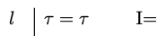
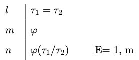

# Identity 

We begin with a distinction between two important binary relations: numerical and qualitative identity. The relation of numerical identity is one an object bears to itself and to nothing else, and it is generally expressed by means of the predicate 'is' or 'is identical to'. Unfortunately, that predicate is sometimes used to express a different relation, one that obtains between two objects if they are similar in every respect that may be relevant for the purposes of a conversation. We use the label 'numerical identity' for the first relation and the label 'qualitative identity' for the second.


Qualitative Identity

: Two objects are qualitatively identical when they share all of the same qualities. 

If Alex and Beth bought two computers of the same make and with the same specifications and even the same color, we may be inclined to say: 

- Alex and Beth bought (qualitative) identical computers.
- The computer Alex bought is identical to the computer Beth bought.
- Alex and Beth bought the same computer.

Numerical Identity

: We speak of numerical identity when two objects are one and the same.

If Alex and Beth do not own different computers but rather happen to share one and the same machine, we may be inclined to say: 

- The computer Alex uses is (numerically) identical to the computer Beth uses.
- Alex and Beth use (one and) the same computer.
- Alex and Beth share (one and) the same computer.


Unfortunately, a variety of sentences are ambiguous between two interpretations of the relevant predicates:

- I have always used the same computer.
- The computer I bought last year is the same you bought now.

On the interpretation of the predicate 'the same' in terms of numerical identity, one and the same computer has been used throughout the years and one and the same computer had been bought by me one year ago and has been bought by you now. On the alternative interpretation in terms of qualitative identity, I have always used computers of the same make and specifications even if more than one, and the computer you bought now is of the same make and specifications as the one I had bought one year ago.

## Syntax {-}

Quantificational logic with identity expands the vocabulary of quantificational logic with a predicate $=$ for numerical identity, which is interpreted to mean: *one and the same object*. All formulas of quantificational logic are formulas of quantificational logic with identity, but the definition of atomic formula of the latter is now expanded:

Atomic Formula

:   All atomic formulas of quantificational logic remain atomic formulas of quantificational logic with identity. Furthermore, if $\tau_1$ and $\tau_2$ are two constants or variables, then
$$
\tau_1 = \tau_2
$$
is an *atomic formula* of quantificational logic and identity.


::: {.example}
Each of the expressions below are atomic formulas of quantificational logic with identity:
$$
\begin{array}{c}
x = y \\ a = x\\ a = b\\ \dots
\end{array}
$$
:::


Formula

:    We now define what is for an expression to be a formula of quantificational logic with identity.

:::{.info}
1. All atomic formulas are *formulas*.\
2. If $\varphi$ and $\psi$ are *formulas*, then each of
$$
\neg  \varphi, (\varphi \wedge \psi), (\varphi \vee \psi), (\varphi \to \psi)
$$
is a *formula*.\
3. If $\varphi$ is a formula and $x$ is a variable, then each of $\forall x \varphi$ and $\exists x \varphi$ is a formula.\
4. Nothing else is a *formula*.
:::


All other definitions carry over without incident to the language of quantificational logic with identity.


## Semantics {-}

The semantics for quantificational logic with identity requires a minimal modification of the semantics for quantificational logic. We retain the definition of a model, an assignment for a model, and that of the denotation of a singular term relative to an assignment. We modify the definition  of truth in a model relative to an assignment in order to accommodate atomic formulas of quantificational logic with identity.

Atomic Formulas

$\tau_1 = \tau_2$ is true in a model $M$ under an assignment $\alpha$ if the denotation of $\tau_1$  relative to $\alpha$ is one and the same object as the denotation of $\tau_2$ relative to $\alpha$.


::: {.example}
```{marginfigure, echo=TRUE}
$D = \{1, 2\}$\
$I(P) = \{1, 2\}$\
$I(Q) = \{2\}$\
$I(R) = \{\langle 1, 2\rangle\}$\
$I(a) = 1$\
$I(b) = 2$
```

Let $\alpha$ be an assignment for the model $M$:
$$
\begin{array}{cccccccccc}
x  & y & z & x_1 &  y_1 & z_1 &  \dots  \\
\hline
1 & 2 & 2 & 2 & 2 & 1  &  \dots \\
\end{array}
$$
Then:

- $b = y$ is true in $M$ relative to $\alpha$ because $I(b)$ is one and the same object as $\alpha(y)$, namely, $2$.
- $x = y$ is *not* true in $M$ relative to $\alpha$ because $\alpha(x)$ is *not* the same object as $\alpha(y)$.
- $a = b$ is *not* true in $M$ relative to $\alpha$ because $I(a)$ is *not* the same object as $I(b)$.
:::

The rest of the definition of truth in a model relative to an assignment and truth in a model carries over to  quantificational logic with identity without incident. So do the definitions of logical truth, equivalence, consistency, and validity.


::: {.example}
The formula $(Pa \to Pb) \to \forall x (x = a \to x = b)$ is *not* a logical truth. 

`r mc_margin_graph(models[["ch11-eg1-counter"]], zoom = 0.8)`

`r mc_iframe_card(models[["ch11-eg1-counter"]], card = "model", solution = TRUE, height = 600L)`


The model verifies the antecedent of the conditional  but not the consequent.

- The formula $Pa \to Pb$ is true in the model because $p_1$ and $p_2$ are each in $I(P)$.

- The formula $\forall x (x = a \to x = b)$ is not true in the model because $x = a \to x = b$ is not true when we assign $p_1$ to $x$. That is because $a$ and $b$ denote different objects in the model.
:::


::: {.example}
Consider the following argument:

1. $\forall x (x = a \to Px)$
2. $a = b$
3. $\forall x (Px \to x = b)$

The model below verifies the premises but falsifies the conclusion.

`r mc_margin_graph(models[["ch11-eg2-counter"]], zoom = 0.8)`

`r mc_iframe_card(models[["ch11-eg2-counter"]], card = "model", solution = TRUE, height = 565)`


- The formula $\forall x (x = a \to Px)$ is true in the model because $(x = a \to Px)$ is true whatever we assign to $x$: if we assign $p_1$ to $x$, then antecedent and consequent come out true, but if we assign $p_2$ to $x$, then the antecedent is false making the conditional true. 

- The formula $a =b$ is true in the model because the denotation of $a$ in the model is the same object as the denotation of $b$ in the model, namely, $p_1$.

- The formula $\forall x (Px \to x = b)$ is false in the model because $(Px \to x = b)$ is not true when we assign $p_2$ to $x$: $p_2$ in in $I(P)$, but it is not one and the same object as the denotation of $b$. 

We conclude that the argument is invalid.
:::


::: {.practice}
Use a model to establish the invalidity of the argument:

1. $Rab \wedge \neg Rac$
2. $\exists x Rcx \wedge \neg Rad$
3. $\neg a = d$

`r mc_embed_counter(models[["ch11-eg3-counter"]], height = 420L, summary = "Show a countermodel")`
:::


## Natural Deduction {-}

We now expand the natural deduction system for quantificational logic with introduction and elimination rules for identity. 

There is a simple introduction rule for identity:

```{marginfigure, echo=TRUE}
\
  Identity Introduction
```

Identity Introduction

:   You may write an identity $\tau = \tau$ by itself on a line.

The rationale for this rule is that since as a matter of logic, all objects are self-identical, whatever $\tau$ may be, it will likewise identical to itself.

:::{.example}
$\forall x (x = x \to x = b) \vdash \forall x \ x = b$.

`r pc_iframe_card(proofs[["ch11-eg4"]], card = "verify", solution = TRUE)`
:::


```{marginfigure, echo=TRUE}
\
  Identity Elimination
```

Identity Elimination

: You may substitute every occurrence of $\tau_2$ for $\tau_1$ in a formula $\varphi$ when both that formula and an identity $\tau_1 = \tau_2$ occur at prior available lines of a proof


The rationale for the elimination rule is that given $\tau_1 = \tau_2$, $\tau_1$ is one the same object as $\tau_2$, which means that whatever is true of one should remain true of the other.


:::{.example}
$\forall x (\neg Rbx \to (Px \to x = b)), Rab \wedge \neg Raa, Rba \to \neg Rab \vdash \neg Pa$

`r pc_iframe_card(proofs[["ch11-eg5"]], card = "verify", solution = TRUE)`
:::


## Uses of Identity {-}

We will use identity to translate overt identity statements such as 'Mark Twain is Samuel Clemens', which becomes $a = b$ relative to a translation key on which $a$ translates 'Mark Twain' and $b$ translates 'Samuel Clemens'. That use of the word 'is' to express numerical identity is to be contrasted with uses of the word on which it expresses a predication, e.g., 'Mark Twain is a writer' which would be translated $P^1a$ relative to a translation key on which $a$ translates 'Mark Twain' and $P$ translates 'is a writer'.

We now look at less overt uses of identity in natural language.

Only 

: Only you arrived on time

```{marginfigure, echo=TRUE}
*Translation key*\
$P$: arrived on time\
$a$: you
```

:::{.argument}
Every *thing* is such that *it* arrived on time only if *it* is identical to you.\
$\forall x (Px \to x =  a)$
:::


Else

:   You arrived on time, but someone else did as well.

```{marginfigure, echo=TRUE}
*Translation key*\
$P$: arrived on time\
$a$: you
```

:::{.argument}
You arrived on time, and some *thing* is such that *it* is not identical to you and *it* arrived on time.\
$Pa \wedge \exists x (\neg  x =  a \wedge Px)$
:::


Number

:   Identity enables us to translate a variety of statements of number.

Some statements of number say that there is at least a certain number of objects of a certain type:

- There are *at least* two books.
- There are *at least* three books.

Others tell us that there are at most a certain number of such objects:

- There is *at most* one book.
- There are *at most* two books.

There is of course no reason to use identity to translate 'there is at least one book' as $\exists x Px$ relative to a translation key on which $P$ translates 'book'. On the other hand, neither $\exists x \exists y (Px \wedge Py)$ nor $\exists x Px \wedge \exists y Py$ are adequate translations of the statement 'there are at least two books' relative to that translation key. For they merely state that something is a book and something is a book, which is compatible with one and the same witness for each existential generalization. We do better with the help of identity, since we are able to offer the following translations for sentences in the first group:

- $\exists x \exists y (Px \wedge Py \wedge \neg x =y)$
- $\exists x \exists y \exists z (Px \wedge Py \wedge Pz \wedge \neg x = y \wedge \neg x = z \wedge \neg y = z)$

It is not difficult to generalize to other numbers, e.g., 'there are at least four books', etc. We are similarly able to offer the following translations for the sentences in the second group:

- $\forall x \forall y (Px \wedge Py \to x = y)$
- $\forall x \forall y \forall z (Px \wedge Py \wedge Pz \to x = y \vee x = z \vee y = z)$

The generalization to other numbers is similarly straightforward.

We are now in a position to translate numerical statements whereby we state the existence of an exact number of objects of a certain type:

- There is *exactly* one book.
- There are *exactly* two books.

The crucial observation at this point is that each of these statements is equivalent to a conjunction of two statements we already know how to translate:

- There is at least one book and there is at most one book.
- There are at least two books and there are at most two books.

The translation of each of these conjunctions becomes:

- $\exists x Px \wedge \forall x \forall y (Px \wedge Py \to x = y)$
- $\exists x \exists y (Px \wedge Py \wedge \neg x =y) \wedge \forall x \forall y \forall z (Px \wedge Py \wedge Pz \to x = y \vee x = z \vee y = z)$

But each of these formulas is equivalent to a more concise version:

- $\exists x (Px \wedge \forall y (Py \to x = y))$
- $\exists x \exists y (Px \wedge Py \wedge \neg x =y \wedge \forall z (Pz \to x = z \vee y = z))$

Definite Descriptions

:   The author of *Huckleberry Finn* is American

We now focus on phrases such as 'the author of *Huckleberry Finn*' or 'instructor', which combine the expression 'the' with a predicate. In quantificational logic, we treated all such expressions as designators, whose primary semantic function is to designate an object. But Bertrand Russell famously suggested that they should instead be treated as quantifier phrases. He offered the following style of paraphrase for sentences involving definite descriptions:

- The instructor arrived on time.
- Exactly one individual is an instructor and she arrived on time.

- The author of *Huckleberry Finn* is American
- Exactly one individual is author of *Huckleberry Finn* and he is American.

Given Russell's paraphrase method, the first sentence translates as:

- $\exists x (Px \wedge \forall y (Py \to x =y) \wedge Qx)$,

relative to a translation key on which $P^1$ translates 'instructor' and $Q^1$ translates 'arrived on time'. Similarly, the second sentence now translates:

- $\exists x (Rxa \wedge \forall y (Rya \to x =y) \wedge Px)$,

relative to a translation key on which $a$ translates '*Huckleberry Finn*', $R$ translates 'authors' and $P$ translates 'American'.


## Exercises {-}

1. For each set of formulas below, find a model we can use to justify the fact that the set is consistent. Please justify your answers.

    a. $\{\forall x (Px \leftrightarrow Qx), Pa, Qb, \neg a = b\}$

        `r mc_embed_counter(models[["ch11-ex1a"]], height = 420L, summary = "Show a model")`

    #. $\{\forall x (Rax \to Rbx), \neg Raa, Rba \}$

        `r mc_embed_counter(models[["ch11-ex1b"]], height = 420L, summary = "Show a model")`


#.  For each argument below, find a model we can use to justify the fact that the argument is invalid. Please justify your answers.

    a. $\forall x (Px \to Qx), \neg Qa \vdash a = b \to Rab$

        `r mc_embed_counter(models[["ch11-ex2a"]], height = 420L, summary = "Show a countermodel")`

    #. $\exists x Px, \exists x Qx \vdash \exists x \exists y \neg x = y$

        `r mc_embed_counter(models[["ch11-ex2b"]], height = 420L, summary = "Show a countermodel")`


<!-- Ex 3.2 uses ↔, which the current proof-checker rejects at parser.js:284;
     keep it as plain LaTeX until the biconditional is supported. -->

#.  Provide a natural deduction proof to justify each of the claims below:

    a.  $\forall x (Px \to Qx), \neg Qa, Pb \vdash a = b \to Rab$

        `r pc_embed_toggle_cards(proofs[["ch11-ex3a"]], proofs[["ch11-ex3a-worked"]], worked_height = 360L)`

    #.  $\exists x Px, \exists x Qx, \neg \exists x (Px \wedge Qx) \vdash \exists x \exists y \neg x = y$

        `r pc_embed_toggle_cards(proofs[["ch11-ex3c"]], proofs[["ch11-ex3c-worked"]], worked_height = 540L)`
